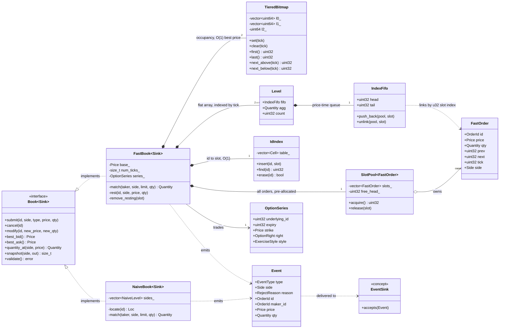

# Limit Order Book & Matching Engine

[](https://github.com/sizzywizzy/Limit-Order-Book/actions/workflows/ci.yml)
[](https://en.cppreference.com/w/cpp/23)
[](https://cmake.org/)
[](LICENSE)

A price-time priority matching engine for a single European option series, in C++23, built as
two interchangeable engines behind one interface: a reference oracle on sorted vectors and
lists, and an optimised engine with a **zero-allocation hot path** — flat price-level arrays, a
three-tier occupancy bitmap for O(1) best-price tracking, intrusive index-linked FIFOs, a
pre-allocated order pool, and a flat open-addressing id index. **No `std::map`, no
`std::unordered_map`, no heap structure anywhere in engine code** — and no heap *allocation*
after construction, proved by a counting allocator rather than asserted.

The design goal is not fast matching. It is **O(1) cancellation** — because cancels, not
trades, are what an exchange actually processes.

| | |
|---|---|
| **Working today** | Both engines · full order-type set (limit, market, IOC, FOK) · modify semantics · deterministic event stream · three test layers green (10,000 property sequences, 1,000,000-op differential) · benchmark harness with recorded baseline · CI with sanitizers · plotting pipeline |
| **Not built yet** | Profiling evidence and optimisation passes (the baseline is the "before" column) · depth/cancel-ratio scaling sweeps · self-trade prevention |
| **Updated** | August 2026 |

---

## Why this exists

Cancels and modifications dominate real exchange message flow — the overwhelming majority of
orders die by cancellation, never by trade. An engine tuned for fast matching but slow
cancellation is tuned for the rare case.

Every significant design decision here follows from that one fact. The intrusive lists, the
order pool, the tiered bitmap and the flat id index all exist so that cancellation requires no
search, no allocation and no scan. The reference engine exists so that the optimised one can be
*proved* equivalent rather than assumed correct.

---

## Results

Median of 5 seeded runs, i7-13700H, g++ 16.2 `-O2 -march=native`, unpinned laptop — full
environment, spread and threats to validity in [RESULTS.md](RESULTS.md). Nanoseconds per
operation:

| Operation | Engine | p50 | p99 | p99.9 |
|---|---|---|---|---|
| Cancel | reference | 942 | 2,587 | 5,625 |
| Cancel | **optimised** | **146** | **428** | **773** |
| Add (passive) | reference | 1,686 | 2,840 | 20,014 |
| Add (passive) | **optimised** | **130** | **404** | **699** |
| Add (aggressive) | reference | 1,516 | 3,580 | 15,614 |
| Add (aggressive) | **optimised** | **240** | **650** | **1,186** |
| Modify (qty down) | reference | 1,380 | 3,375 | 5,530 |
| Modify (qty down) | **optimised** | **90** | **305** | **630** |

Steady-state allocations in the optimised engine over 100,000 operations: **0** (counted, not
asserted).

**Every figure here is generated, none typed.** One `scripts/plot.py` invocation over the ten
sample CSVs writes this table, the figures in RESULTS.md, *and* the dashboard's data, all from
the same median run — so a stale plot or a dashboard that disagrees with RESULTS.md is not
possible. The pipeline is four commands:
[Reproducing these numbers](RESULTS.md#reproducing-these-numbers).

---

## Quickstart

Requires CMake 3.16+ and a C++23 compiler (g++ 13+ / clang 17+). Catch2 v3 is fetched at
configure time, or used from the system if already installed.

```bash
git clone https://github.com/sizzywizzy/Limit-Order-Book.git && cd Limit-Order-Book
cmake -B build -DCMAKE_BUILD_TYPE=Release
cmake --build build -j
ctest --test-dir build --output-on-failure
./build/ob_demo        # one European series, a few orders, events + L2 depth
```

**No CMake or Catch2 available?** The standalone runner needs nothing but a compiler and runs
the same harness, scenarios, differential and zero-alloc layers:

```bash
g++ -std=c++23 -O2 -I include tests/standalone_runner.cpp -o ob_check
./ob_check                      # CI-sized: fuzz + scenarios + properties + differential
./ob_check 10000 300 1000000    # the full definition-of-done run (~40 s)
```

<details>
<summary><b>Build options</b></summary>

| Option | Default | Purpose |
|---|---|---|
| `OB_BUILD_TESTS` | `ON` | Build the four test executables |
| `OB_BUILD_BENCH` | `ON` | Build `ob_bench` |
| `OB_WERROR` | `OFF` | Warnings as errors — CI sets this |
| `OB_NATIVE` | `OFF` | `-march=native`; **required for any benchmark run** |
| `OB_SANITIZE` | `OFF` | ASan + UBSan |

The sanitised build exists for one specific bug. Returning an order slot to the pool while the
id index still points at it is a use-after-free that typically surfaces only under load, so it
is checked mechanically rather than by reading the code:

```bash
cmake -B build-asan -DCMAKE_BUILD_TYPE=Debug -DOB_SANITIZE=ON
cmake --build build-asan -j && ctest --test-dir build-asan --output-on-failure
```

</details>

<details>
<summary><b>Benchmarks</b></summary>

```bash
cmake -B build -DCMAKE_BUILD_TYPE=Release -DOB_NATIVE=ON && cmake --build build -j
./build/bench/ob_bench --engine=fast  --orders=2000000 --seed=1 --out=data/fast.csv
./build/bench/ob_bench --engine=naive --orders=300000  --seed=1 --out=data/naive.csv
cat data/fast.csv <(tail -n +2 data/naive.csv) > data/results.csv
python3 scripts/plot.py data/results.csv --outdir docs/figures
```

`ob_bench` prints its seed, mix, timer and calibration with every run; one CSV row per measured
operation (`engine,operation,latency_ns`), percentiles computed only in the plot script so the
raw sample set stays available. Methodology — warm-up discard, per-operation buckets,
median-of-5-seeds — in [RESULTS.md](RESULTS.md#methodology).

</details>

---

## Repository layout

```
include/ob/
  types.hpp              Price, Quantity, OrderId, Side, OrderType, LevelView   ✅
  instrument.hpp         European option series (the only representable style)  ✅
  events.hpp             deterministic event stream + compile-time sinks        ✅
  order.hpp              the reference engine's order value type                ✅
  book_naive.hpp         reference engine: sorted vectors + lists, no index     ✅
  book_fast.hpp          optimised engine                                       ✅
  pool.hpp               pre-allocated slot pool + free list                    ✅
  intrusive_list.hpp     index-linked intrusive FIFO                            ✅
  bitmap.hpp             three-tier occupancy bitmap (O(1) best price)          ✅
  id_index.hpp           flat open-addressing id → slot index                   ✅
src/demo.cpp             one series end-to-end: orders in, events + depth out   ✅
tests/
  harness.hpp            seeded flow generator + event-ledger invariants        ✅
  scenarios.hpp          the unit scenario set, engine-generic                  ✅
  test_basic.cpp         value types, components, scenarios on both engines    ✅
  test_properties.cpp    invariants after every op, replay, zero-alloc proof    ✅
  test_differential.cpp  naive vs fast, whole-stream equality                   ✅
  standalone_runner.cpp  everything above with zero dependencies                ✅
bench/
  generator.hpp/.cpp     cancel-heavy synthetic flow, event-driven targeting    ✅
  bench_main.cpp         latency harness (rdtsc, per-op buckets, CSV)           ✅
scripts/plot.py          percentile tables and figures from CSV                 ✅
```

| Document | Answers |
|---|---|
| [ARCHITECTURE.md](ARCHITECTURE.md) | What the system is — components, operations, complexity |
| [DECISIONS.md](DECISIONS.md) | Why each choice was made, and what was rejected (001–010) |
| [RESULTS.md](RESULTS.md) | How performance is measured, and what was measured |

---

## Scope

**Instrument** — one **European option series** per book (`OptionSeries`: underlying, expiry,
strike, call/put). European exercise means no intraday lifecycle events can touch resting
orders, which is what lets the matching core stay instrument-agnostic *by construction* —
`ExerciseStyle` has exactly one value, so American is unrepresentable, not merely unhandled
([DECISIONS.md 009](DECISIONS.md)).

**Order types** — limit (passive and aggressive), market, immediate-or-cancel, fill-or-kill
(with a no-partial-execution pre-pass).

**Operations** — add; O(1) cancel; modify (in-place quantity reduction preserving queue
position, cancel-replace on price change or increase); partial fills across multiple levels;
level-2 snapshots; per-order open-quantity query; a deterministic
Accepted/Trade/Reduced/Cancelled/Rejected event stream through a compile-time sink.

**Guarantees the tests enforce**

- Deterministic: identical input produces a value-identical event stream, across runs and
  across both engines — checked after every operation, not at the end.
- Zero heap allocation in the optimised engine after construction — proved with a counting
  global allocator, continuously, in the test suite.
- The book never crosses; aggregates never drift; no ghost levels — asserted after every
  operation in the property layer.

---

## Architecture

Both engines satisfy one interface and emit the same events; the optimised one composes four
owned structures, none of which is a map or a heap.



The composition is the design argument: `Level` holds only a head/tail pair, the FIFO's links
live inside `FastOrder` in the pool, and the bitmap answers "best price" without either a tree
or a cursor to keep coherent.

| Component | Reference engine | Optimised engine |
|---|---|---|
| Price levels | Sorted `std::vector`, `lower_bound` | Flat array indexed by tick offset |
| Best bid / ask | Vector front/back | Three-tier bitmap, ≤3 find-first-set ops |
| FIFO at a level | `std::list<Order>` | Intrusive doubly-linked list, u32 slot indices |
| Id lookup | Linear scan (no index at all) | Flat open addressing, backward-shift deletion |
| Order storage | Per-order list allocation | Pre-allocated pool, free list through `next` |
| Cancel | O(N) scan | **O(1)**, no loop in the code path |

Neither engine contains a map or a heap; the optimised one also never allocates after
construction. The measured difference (see Results) is allocation, pointer chasing and cache
behaviour — exactly the constant factors the design targets. Detail in
[ARCHITECTURE.md](ARCHITECTURE.md).

---

## Testing

Three layers, each its own executable so a failure names its layer — plus a dependency-free
runner that packages all three:

| Layer | Executable | What it establishes |
|---|---|---|
| Unit | `ob_test_basic` | Value types, bitmap and id-index components, and the full scenario set (every order type, every modify semantic, every reject reason) on **both** engines |
| Property | `ob_test_properties` | Five invariants after *every* operation over seeded random sequences; deterministic replay; the zero-allocation proof |
| Differential | `ob_test_differential` | Whole event streams value-identical between engines, state cross-checked at checkpoints |
| All of the above | `ob_test_standalone` | Same harness with no framework — `g++ -I include tests/standalone_runner.cpp` is the entire build |

```bash
ctest --test-dir build --output-on-failure          # everything
ctest --test-dir build -R differential              # one layer
./build/tests/ob_test_properties "[slow]"           # 10,000-sequence run
./build/tests/ob_test_differential "[slow]"         # 1,000,000-op run
```

The differential layer is the one that matters: it is what licenses any claim that the
optimised engine is correct across input space, rather than on the cases someone thought to
write down. **Current state:** all layers green — 10,000 property sequences × both engines and
a 1,000,000-operation differential run pass locally (36 s, `-O2`), repeated clean under
`_GLIBCXX_DEBUG` hardening; CI repeats the suite under ASan/UBSan on every push.

---

## Limitations

Stated deliberately rather than left for a reader to find. Each is a scope decision, and each
is defensible.

- **Single instrument per book.** A venue quoting an option chain instantiates one (cheap) book
  per series; a symbol-indexed router sits above, out of scope.
- **Single threaded.** No concurrency control; the engine assumes exactly one writer. A
  matching engine core is conventionally single-threaded because the sequencing *is* the
  product — price-time priority requires a total order over events.
- **Bounded price range.** The level array covers `[base, base + num_ticks)`, up to 262,144
  ticks. Orders outside are rejected explicitly (`PriceOutOfRange`).
- **Fixed pool capacity.** Set at construction; a full book rejects new limit orders
  (`CapacityExhausted`) rather than growing. IOC/FOK/market still match when full.
- **OrderId 0 is reserved** as the id-index empty marker; submitting it is rejected
  (`InvalidId`).
- **No self-trade prevention yet.** Needs an owner field on orders and a policy choice; tracked
  in DECISIONS.md's rejected-for-now list.
- **No persistence or crash recovery.**

---

## What I would do next

- **Profile before optimising further.** The baseline table is the "before" column;
  `perf stat` + cachegrind under WSL2/CI to see whether the remaining time is cache misses (the
  bitmap says it shouldn't be) or the id-index probe.
- **Scaling sweeps.** Depth 10 → 10,000 and cancel-ratio 0.5 → 0.99 (`--depth`,
  `--cancel-ratio` already exist) — the plots that show O(N) vs O(1) rather than claiming it.
- **A taker-terminal event** (`Done`/`Filled`) so fully-consumed IOC/market orders don't end
  silently — listed as an open question in DECISIONS.md.
- **Self-trade prevention** once orders grow an owner field, with the policy matrix documented
  before the code, per the house rule.

---

## References

- NASDAQ TotalView-ITCH 5.0 specification
- Larry Harris, *Trading and Exchanges*, ch. 4–7
- Ulrich Drepper, *What Every Programmer Should Know About Memory*

## License

MIT — see [LICENSE](LICENSE).
