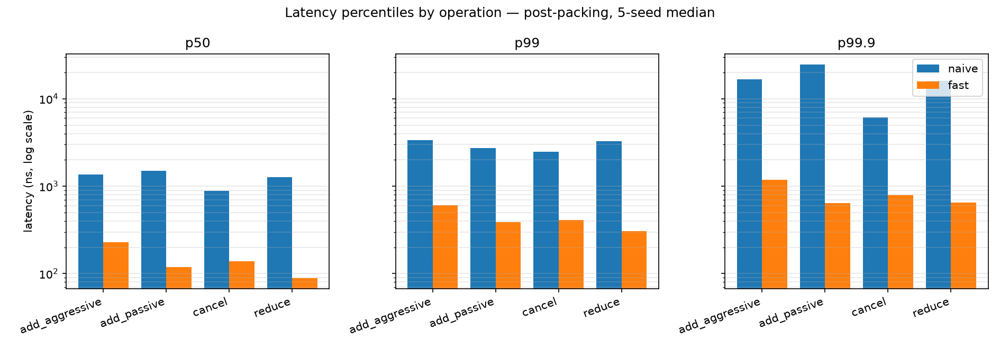
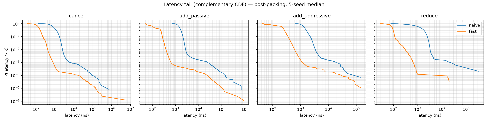
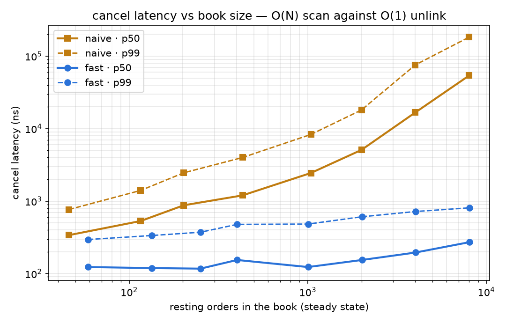

# Benchmark results

All latency figures are nanoseconds per operation unless stated otherwise.

**Methodology is specified before any numbers appear**, so the numbers can be judged against a
stated standard rather than taken on trust.

> [!NOTE]
> The figures below are a **first baseline** from a development laptop — unpinned thread,
> frequency scaling active, Windows. They are honest about that (see
> [Threats to validity](#threats-to-validity)) and good enough to establish the shape of the
> comparison; they are not exchange-colo numbers. No optimisation passes have been run yet —
> this table is the "before" column of the optimisation history to come.

---

## Methodology

### Environment

| | |
|---|---|
| CPU | Intel Core i7-13700H (13th gen), 14 cores / 20 threads, TSC ≈ 2.92 GHz |
| Caches | 24 MiB L3, 11.5 MiB total L2 |
| Memory | 16 GiB LPDDR5-6400 |
| OS / kernel | Windows 11 Home 10.0.26200 |
| Compiler | g++ 16.2.0 (MSYS2 UCRT64) |
| Flags | `-std=c++23 -O2 -march=native -DNDEBUG` |
| Frequency scaling | **Enabled** (laptop; not controlled) |
| Thread pinning | **Not pinned** |
| Timer | `rdtsc`, unserialised, calibrated against `steady_clock` over 200 ms at startup (≈2.92 ticks/ns on this machine); the calibration is printed by every run |

### Measurement rules

These are applied to every figure in this document:

1. **Percentiles, never means.** p50, p99, p99.9, p99.99, max. In latency-sensitive systems the
   tail is the product; a mean conceals exactly the behaviour being measured.
2. **Per operation type, separately.** Cancel, passive add, aggressive add and in-place reduce
   differ by up to an order of magnitude. Adds are classified by what actually happened
   (traded ⇒ aggressive), not by intent.
3. **Warm-up discarded.** The first 10% of operations (200,000 for the fast runs) are executed
   but not recorded.
4. **Median of 5 runs**, seeds 1–5, with the observed spread reported below. Every reported
   figure comes from the median run *by cancel p50, chosen per engine* — pooling runs would
   report a percentile of a mixture, which is not a latency any single run exhibited.
   `scripts/plot.py` picks that run and writes the table, the figures and the dashboard's data
   from it in one pass; none of the three is ever typed by hand.
5. **Environment held constant** across every comparison in a given table; both engines run the
   identical seed-5 flow.

### Workload

Synthetic order flow from `bench/generator.hpp`, all parameters printed by each run:

| Parameter | Value | Rationale |
|---|---|---|
| Cancel ratio | 0.90 **per add** | ~9 of 10 resting orders die by cancellation, matching real order-to-trade ratios. (A raw "90% of messages" reading cannot hold in steady state — removals would have to outrun additions — so the generator normalises {add=1, cancel=0.9, reduce=0.05} into a message mix of ≈51% adds / 46% cancels / 3% reduces and keeps the book populated.) |
| Aggressive fraction | 0.10 of submits | Most orders rest; a minority cross |
| Price distribution | Geometric around the touch, thinning outward | Uniform prices give an unrealistically flat book and flattering cache behaviour |
| Order size | 1 + geometric (mean ≈ 4), 3% sweepers of 50–500 | Many small, few large — drives multi-level sweeps |
| Steady-state population | ~200–260 resting orders over ~50 levels/side | Guardrails refill below 4×depth |
| Band / capacity | 16,384 ticks / 65,536 orders | Fast-engine structures exercised at realistic size |
| Total operations | Fast: 2,000,000/run · Naive: 300,000/run | After 10% warm-up |

Seeds are fixed and recorded: `1 2 3 4 5`; every table below states which run it came from.

Cancel and reduce targets are always live orders (the harness tracks the book from its own
event stream), so the cancel bucket measures cancels, not rejection paths. All harness
bookkeeping happens outside the timed window; the engine call is the only code between
timestamps.

---

## Headline comparison

Each engine's **median run by cancel p50** out of 5 seeds (naive: seed 2, fast: seed 4). The
table below is `docs/figures/latency_percentiles.md`, pasted verbatim — it, the figures, and
every number in the dashboard come from one invocation of `scripts/plot.py` over the same ten
CSVs, so they cannot disagree (see [Reproducing these numbers](#reproducing-these-numbers)):

| Operation | Engine | Samples | p50 | p99 | p99.9 | p99.99 | max |
|---|---|---|---|---|---|---|---|
| add_aggressive | naive | 14,229 | 1,369 | 3,385 | 16,771 | 39,041 | 147,608 |
| add_aggressive | fast | 95,558 | 230 | 610 | 1,175 | 24,859 | 149,912 |
| add_passive | naive | 128,974 | 1,494 | 2,734 | 24,584 | 139,639 | 692,919 |
| add_passive | fast | 859,360 | 119 | 387 | 639 | 22,973 | 883,532 |
| cancel | naive | 122,000 | 880 | 2,492 | 6,130 | 85,051 | 733,089 |
| cancel | fast | 812,590 | 138 | 408 | 794 | 17,856 | 5,875,189 |
| reduce | naive | 4,797 | 1,271 | 3,261 | 16,059 | 82,852 | 328,441 |
| reduce | fast | 32,492 | 89 | 308 | 646 | 937 | 20,075 |




Reading the table rather than a ratio: at ~200 resting orders the naive cancel's O(N) scan
costs ~880 ns; the fast cancel — hash probe, four link writes, bitmap clear — costs ~138 ns, of
which a measurable share is the rdtsc pair itself. The gap in *passive add* (119 vs 1,494 ns)
is allocation: the naive engine pays a `std::list` node per order.

That is one book size. The gap is not a constant, and [Scaling behaviour](#scaling-behaviour)
below is the measurement that matters more than this table.

**Wall-clock throughput** (whole run ÷ wall time; includes the *untimed* harness bookkeeping,
so this understates the engines and is only comparable engine-to-engine):

| Engine | Operations/second (5-run range) |
|---|---|
| Reference | 411k – 462k |
| Optimised | 1.04M – 1.31M |

> [!NOTE]
> Absolute numbers here run 20–30% higher than the first recording on this machine (fast
> cancel p50 was 112 ns on an idle run, 138 ns here) because the laptop was busier — on
> **both** engines, so comparisons hold while the absolutes move. The one figure worth
> distrusting outright is fast cancel `max` (5.9 ms): a single sample, three orders of
> magnitude past p99.99, which is an OS scheduling event captured inside a timed region, not
> anything the engine did. It is left in rather than trimmed, because the rule here is that
> the reported set is the observed set.

---

## Reproducing these numbers

Every artifact in this document — the table above, both figures, and the interactive dashboard
— is regenerated by these four commands. Nothing downstream of `ob_bench` is hand-written, so
a stale figure or a dashboard that disagrees with this file is not possible; the dashboard
carries the generating command's date, source files and git revision in its footer.

```bash
cmake -B build -DCMAKE_BUILD_TYPE=Release -DOB_NATIVE=ON && cmake --build build -j

for s in 1 2 3 4 5; do
  ./build/bench/ob_bench --engine=fast  --orders=2000000 --seed=$s --out=data/fast_s$s.csv
  ./build/bench/ob_bench --engine=naive --orders=300000  --seed=$s --out=data/naive_s$s.csv
done
./build/bench/ob_bench --replay-out=data/replay.json --replay-ops=2600 --seed=42

python3 scripts/plot.py data/*.csv --outdir docs/figures
python3 scripts/build_dashboard.py
```

`plot.py` writes `latency_percentiles.{csv,md,png}`, `latency_tail.png` and
`dashboard_data.json`; `build_dashboard.py` injects that plus the replay recording into
`docs/dashboard.template.html` and writes `docs/dashboard.html`. Paste the generated
`latency_percentiles.md` over the table above — it is the only manual step, and it is a copy,
not a transcription.

The replay recording is a *demonstration* mix rather than the latency workload: a small price
band so a depth ladder is legible, more order-type variety, and ~2% deliberately out-of-band
orders so the rejection path appears on the tape. It is timed by nothing and measured for
nothing; it exists to show the engine's event stream is complete enough to rebuild the book
from (DECISIONS.md 008).

---

## Optimisation history

One row per change. **Record the failures too** — a write-up containing "I tried this, it made
no measurable difference, and here is why I think that is" reads as considerably more credible
engineering than an unbroken list of wins.

The engine's first measured build *is* the design described in DECISIONS.md 003–008 (flat
levels, tiered bitmap, index-linked intrusive FIFOs, slot pool, flat id index); that is the
baseline every row below is measured against.

| # | Change | Hypothesis | Cancel p50 before | after | Δ | Kept? |
|---|---|---|---|---|---|---|
| 1 | Drop the stored `price` from `FastOrder` (40 B → 32 B) | The field duplicates `base + tick`; removing it fits two orders per cache line instead of 1.6 | 152 | 140 | −7.9% | **Yes** |

### Notes on individual changes

#### 1. Packing `FastOrder` to 32 bytes

`FastOrder` carried both `price` and `tick`, but a resting order's price *is* `base + tick` —
the field was eight bytes of duplicated state that could in principle drift, and it pushed the
slot to 40 bytes, or 1.6 per 64-byte cache line. Dropping it and recomputing the price in one
add lands the struct at exactly 32 bytes, two per line, pinned by a `static_assert`.

Measured 5 seeds × 2M operations, before and after back to back on the same machine, medians
across seeds:

| Operation | p50 before | p50 after | Δ | p99 before | p99 after | Δ |
|---|---|---|---|---|---|---|
| cancel | 152 | 140 | −7.9% | 437 | 428 | −2.1% |
| add_passive | 154 | 126 | −18.2% | 424 | 393 | −7.3% |
| add_aggressive | 245 | 235 | −4.1% | 681 | 629 | −7.6% |
| reduce | 91 | 90 | −1.1% | 323 | 349 | +8.0% |

**Kept.** The honest summary is "small, consistent, and smaller than the headline numbers
suggest." 41 of 58 paired seed-by-seed comparisons came out faster, which under a sign test is
significant (p ≈ 0.002); that consistency is the evidence, not any single percentage. Passive
add gains most, which fits the mechanism — it writes one fewer eight-byte field into a freshly
acquired slot, and it is the operation that touches the most cold slots.

What is *not* claimed: the p99.9 figures moved by −46% (add_passive) and −33%
(add_aggressive), which looks spectacular and is noise. Those per-seed deltas swing between
−1,342 ns and +9 ns on the same configuration — larger than the effect being measured. On an
unpinned laptop the deep tail is the scheduler's, not the engine's, and reporting it as a win
would be the kind of number-picking this document exists to prevent.

Reduce's p99 got 8% *worse*, and with four samples' worth of spread behind it, that is
unattributable either way. Recorded rather than dropped.

---

## Profiling evidence

Not yet collected. `perf stat` / cachegrind require the Linux toolchain (WSL2 or CI); the
Windows baseline above was produced first so the profiling session has numbers to be checked
against. Planned: cycles, instructions, IPC, cache-miss and branch-miss rates for both engines
on the identical seed-5 workload.

### Allocation count in the steady state

Counted by a replacement global `operator new`/`delete`
([tests/alloc_counter.hpp](tests/alloc_counter.hpp)) — not asserted, counted:

| Engine | Allocations during 100,000 steady-state operations (after warm-up) |
|---|---|
| Reference | not measured (allocates by design: list nodes, level splices) |
| Optimised | **0** |

Enforced continuously by `ob_test_properties` ("fast engine allocates nothing in the steady
state") and the standalone runner.

---

## Scaling behaviour

### Cancel latency vs book size

The claim the whole design rests on: the reference engine finds an order by scanning, so its
cancel cost grows with the book; the optimised engine hashes an id to a slot and unlinks four
pointers, so it does not. Swept with `scripts/sweep_depth.py`, seed 1, depth 10 → 2,000
(the flow holds the book at roughly 4× depth):



| Depth | Resting orders | Engine | cancel p50 | p99 | p99.9 |
|---|---|---|---|---|---|
| 10 | 46 | naive | 339 | 765 | 932 |
| 10 | 59 | fast | 123 | 295 | 547 |
| 25 | 116 | naive | 531 | 1,403 | 1,782 |
| 25 | 134 | fast | 119 | 335 | 625 |
| 50 | 202 | naive | 875 | 2,454 | 7,909 |
| 50 | 251 | fast | 117 | 372 | 694 |
| 100 | 431 | naive | 1,198 | 3,991 | 9,075 |
| 100 | 402 | fast | 154 | 477 | 944 |
| 250 | 1,041 | naive | 2,441 | 8,301 | 28,086 |
| 250 | 1,004 | fast | 123 | 482 | 839 |
| 500 | 1,999 | naive | 5,083 | 18,072 | 72,967 |
| 500 | 2,012 | fast | 154 | 608 | 1,073 |
| 1,000 | 4,001 | naive | 16,693 | 75,638 | 299,383 |
| 1,000 | 4,008 | fast | 195 | 718 | 1,127 |
| 2,000 | 8,019 | naive | 54,062 | 183,064 | 422,406 |
| 2,000 | 8,033 | fast | 271 | 807 | 1,142 |

**Across a 174× increase in book size, the reference engine's cancel p50 grew 159× and the
optimised engine's grew 2.2×** (339 ns → 54,062 ns against 123 ns → 271 ns). The reference
line is linear in N to within the noise, which is what an unindexed scan should be. At the
largest book measured the gap is a factor of 200.

The interesting result is that the optimised engine is *not* perfectly flat. 2.2× over that
range is real and it is not the algorithm — the cancel path executes the same instruction
count at every depth. It is the memory hierarchy: at 8,000 resting orders the pool spans
~256 KiB and the id index 2 MiB, so the hash probe and the slot access that were L1/L2 hits
at depth 10 start missing to L3. **O(1) in operations is not O(1) in cache**, and this plot is
where that distinction becomes visible rather than theoretical. `perf stat` is the measurement
that would confirm the mechanism — see [Profiling evidence](#profiling-evidence).

### Latency vs cancel ratio

Not yet run. Sweeping the cancel ratio from 0.5 to 0.99 should widen the gap as cancels come
to dominate the mix, which is the same argument from the other direction.

---

## Correctness evidence

Performance figures mean nothing without this section. Current tree, verified on the
environment above (g++ 16.2, `-O2`, assertions enabled for the test builds):

| Check | Result |
|---|---|
| Unit + component checks (standalone runner, both engines) | **86 / 86 passing** |
| Property test sequences | **10,000 sequences × 300 ops × both engines**, all invariants held after every operation |
| Differential test | **1,000,000 operations**, naive and fast event streams value-identical after every operation; state cross-checked every 256 ops |
| Deterministic replay | Same input → identical event stream across 2 fresh runs (50,000 ops) |
| Steady-state allocations (fast engine) | **0** over 100,000 post-warm-up operations |
| Hardened rerun | Full suite repeated under `-D_GLIBCXX_DEBUG -D_GLIBCXX_ASSERTIONS`: 86 / 86 |

Invariants asserted after every operation in property tests:

- Book never crosses (`best_bid < best_ask` when both sides non-empty)
- Conservation: every accepted quantity accounted for as resting + traded + cancelled +
  discarded, reconstructed from the event stream alone and reconciled against the book
- Every id resolves to a live resting order (and in the fast engine, to the exact pool slot)
- Every level's cached aggregate equals the sum of its orders' quantities
- No empty level remains active; FIFO links are bidirectionally consistent

---

## Threats to validity

Stated honestly rather than left to be discovered:

- **Unpinned, uncontrolled clocks.** Laptop, frequency scaling on, other processes running.
  p50/p99 are stable across seeds (spread table above); p99.99 and max are not — treat the
  extreme tail columns as noise ceilings, not engine properties.
- **Unserialised `rdtsc`.** The timestamp pair costs a few nanoseconds and is not subtracted;
  small absolute values (the 79–112 ns p50s) carry that overhead inside them. No fencing means
  occasional reordering jitter, traded for not perturbing the pipeline being measured.
- **Synthetic flow is a model.** Distribution choices are documented above but not validated
  against a real ITCH capture. The cancel-ratio semantics (per add, not per message) is a
  modelling decision — the raw-message reading empties the book and would benchmark nothing.
- **Small steady-state book.** ~200 resting orders flatters the naive engine's O(N) scan; the
  gap understates what a deep book would show. The depth sweep is the planned follow-up.
- **The engines differ functionally at the margin.** The fast engine's bounded price band and
  fixed capacity are design constraints, not just speedups; the naive engine mirrors them for
  comparability, so neither measures an unbounded-book design.
- **Single machine, single compiler, single run family.** No cross-platform numbers yet; the
  CI matrix builds and tests on Linux gcc/clang but does not benchmark.
